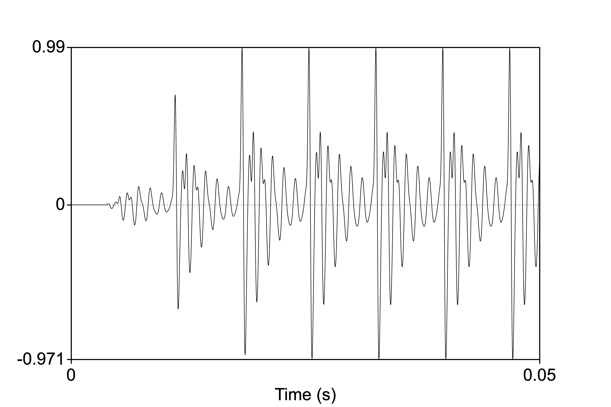
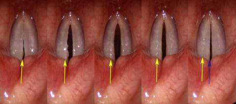
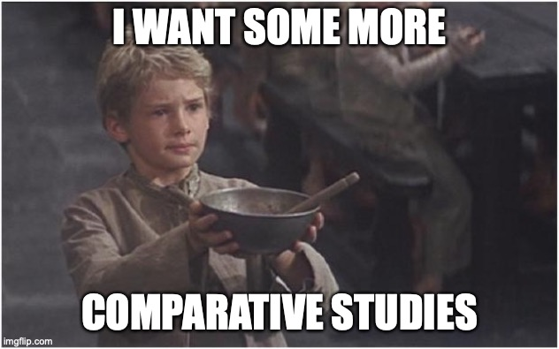
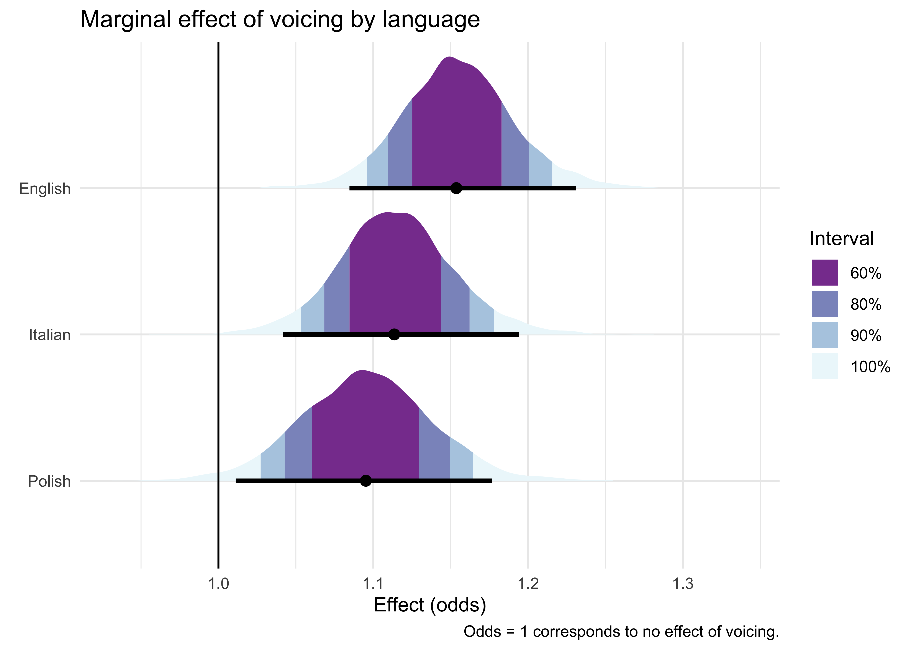
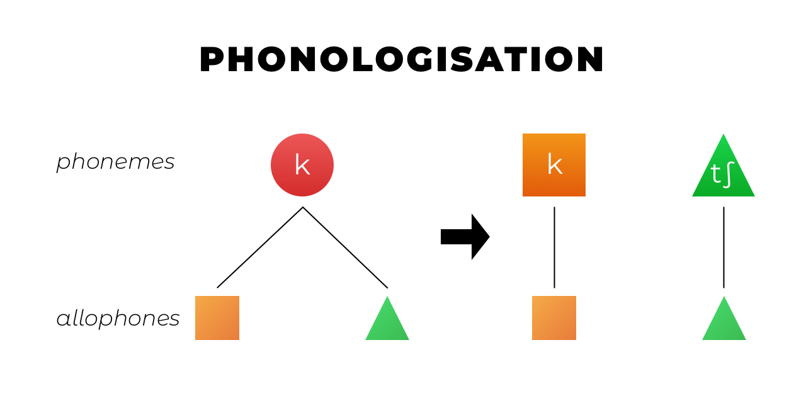
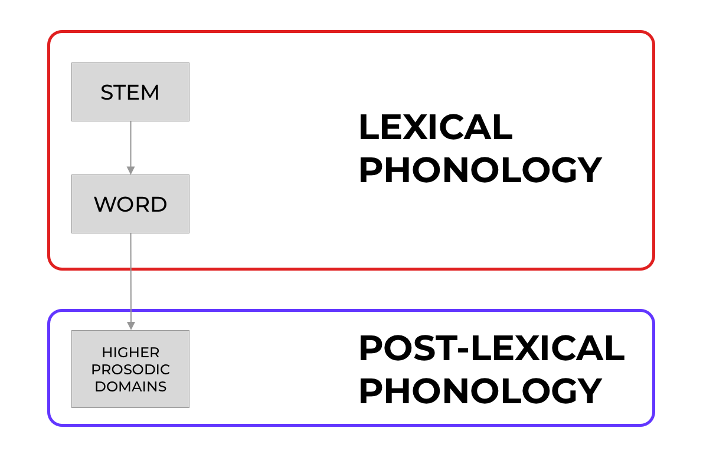
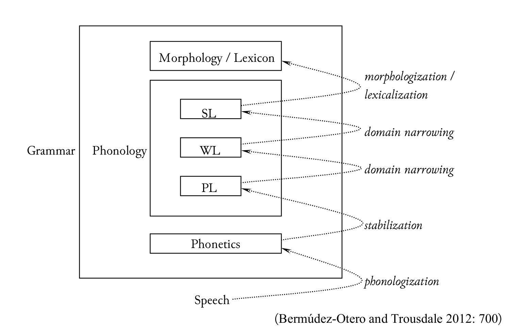
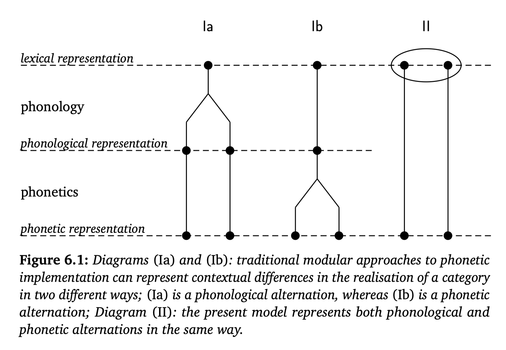
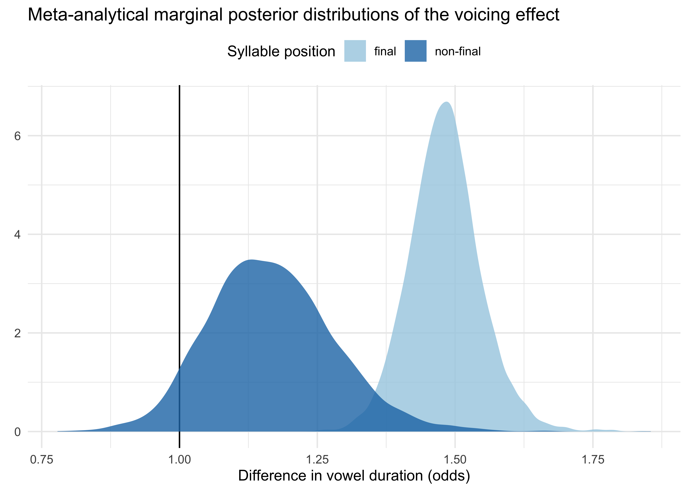

```{r setup, include=FALSE}
knitr::opts_chunk$set(echo = FALSE)
library(tidyverse)
library(rnaturalearth)
library(leaflet)
library(sf)
library(lingtypology)
library(RColorBrewer)
library(xaringanExtra)
use_xaringan_extra(c("panelset", "tachyons"))
```


class: center middle

# ~ Voicing effect ~


---

# What is "voicing"?

.center[

]


---

# Voicing as a physical property

.pull-left[
.center.f1.small-caps.bg-washed-green.ba.bw2.br3.b--dark-green[acoustic]

.center[Periodicity in the speech signal.]




]

.pull-right[
.center.f1.small-caps.bg-washed-red.b--dark-red.ba.bw2.br3[articulatory]

.center[Cyclic vibration of the vocal folds.]

<br>



.f6.pull-right[CC BY-NC-SA 3.0 James Thomas]
]

---

# Voicing as a lexical contrast

.f6[(Haspelmath 2010, 2015, 2020, 2021)]

.pull-left[
.center.f3.small-caps[language-particular category]

<br>

.pull-left[
**Northern Italian**
  - /t/ = [t]
  - /d/ = [d]

**Spanish**
  - /t/ = [t]
  - /d/ = [d], [ð], [θ]
]

.pull-right[
**Mawayana** .f6[(Coretta 2013)]
  - /t/ = [t]
  - /ɗ/ = [ɗ], [d̰], [d]

**Nalögo** .f6[(Alfarano 2021)]
  - /t/ = [t], [tʰ], [ɾ]
  - /d/ = [ⁿd], [d]
]

]

--

.pull-right[
.center.f3.small-caps[comparative concept]

<br>

.bg-washed-green.bw2.br3.center[
.f1.small-caps[voicing]
]

<br>

.f2.center.small-caps[voiceless ~ voiced]

]

--

.pull-right[
VE in **whispered** speech and in **word-final-devoicing** languages.
]


<!-- ----------------------------------------------------------------- -->
<!-- ----------------------------------------------------------------- -->
<!-- ----------------------------------------------------------------- -->
<!-- ----------------------------------------------------------------- -->


---

class: center middle inverse

<iframe src="https://wall.sli.do/event/bhuf7xqj" width="1000" height="600" style="border:none;"></iframe>

???

https://app.sli.do/event/bhuf7xqj

<!-- ----------------------------------------------------------------- -->
<!-- ----------------------------------------------------------------- -->
<!-- ----------------------------------------------------------------- -->
<!-- ----------------------------------------------------------------- -->

---

# Myths

<br>

.bg-washed-green.b--dark-green.ba.bw2.br3.shadow-5.ph4.mt3[
**Myth 1**. The voicing effect is a very common phenomenon.
]

.bg-washed-green.b--dark-green.ba.bw2.br3.shadow-5.ph4.mt3[
**Myth 2**. Polish and Czech do not show a voicing effect.
]

.bg-washed-green.b--dark-green.ba.bw2.br3.shadow-5.ph4.mt3[
**Myth 3**. The magnitude of the voicing effect in English is greater than that of other languages.
]

.bg-washed-green.b--dark-green.ba.bw2.br3.shadow-5.ph4.mt3[
**Myth 4**. The voicing effect is modulated by phonological contexts in systematic ways.
]


<!-- ----------------------------------------------------------------- -->
<!-- ----------------------------------------------------------------- -->
<!-- ----------------------------------------------------------------- -->
<!-- ----------------------------------------------------------------- -->

---

class: middle

# How common is the voicing effect?

```{r ve-map, echo=FALSE}
langs <- c("English", "German", "French", "Hungarian", "Gulf Arabic", "Assamese", "Bengali", "Dutch", "Georgian", "Hindi", "Italian", "Icelandic", "Japanese", "Korean", "Lithuanian", "Norwegian", "Spanish", "Swedish", "Telugu", "Russian", "Czech", "Polish")

longs <- long.lang(langs)
lats <- lat.lang(langs)
fams <- str_split_fixed(aff.lang(langs), ",", n = Inf)[,1]

ve_langs <- tibble(longs, lats, fams) %>%
  st_as_sf(coords = c("longs", "lats"))

pal <- colorFactor(
  brewer.pal(7, "Accent"),
  domain = unique(ve_langs$fams)
)

leaflet(ve_langs, width = "100%", height = "400") %>% 
  addTiles() %>%
  addCircleMarkers(stroke = FALSE, fillOpacity = 0.8, color = ~pal(fams)) %>%
  addLegend(pal = pal, values = ~fams, title = "Family")
```


<!-- ----------------------------------------------------------------- -->
<!-- ----------------------------------------------------------------- -->
<!-- ----------------------------------------------------------------- -->
<!-- ----------------------------------------------------------------- -->

---

# Myths

<br>

.bg-washed-red.b--dark-red.ba.bw2.br3.shadow-5.ph4.mt3[
**Myth 1**. The voicing effect is a very common phenomenon.
]

.bg-washed-green.b--dark-green.ba.bw2.br3.shadow-5.ph4.mt3[
**Myth 2**. Polish and Czech do not show a voicing effect.
]

.bg-washed-green.b--dark-green.ba.bw2.br3.shadow-5.ph4.mt3[
**Myth 3**. The magnitude of the voicing effect in English is greater than that of other languages.
]

.bg-washed-green.b--dark-green.ba.bw2.br3.shadow-5.ph4.mt3[
**Myth 4**. The voicing effect is modulated by phonological contexts in systematic ways.
]


<!-- ----------------------------------------------------------------- -->
<!-- ----------------------------------------------------------------- -->
<!-- ----------------------------------------------------------------- -->
<!-- ----------------------------------------------------------------- -->

---

# Polish and Czech: do they or do they not?

<br>

|            | Absence of a VE         | Presence of a VE            |
|:-----------|:------------------------|:----------------------------|
| **Polish** | Jassem & Richter (1989) | Slowiaczek & Dinnsen (1985) |
|            | Keating (1984)          | Nowak (2006)                |
|            | Strycharczuk (2012)     | Malisz & Klessa (2008)      |
|            |                         | Coretta (2019)              |
|            |                         |                             |
| **Czech**  | Keating (1984a)         | Machač & Skarnitzl (2007)   |


<!-- ----------------------------------------------------------------- -->
<!-- ----------------------------------------------------------------- -->
<!-- ----------------------------------------------------------------- -->
<!-- ----------------------------------------------------------------- -->

---

# Myths

<br>

.bg-washed-red.b--dark-red.ba.bw2.br3.shadow-5.ph4.mt3[
**Myth 1**. The voicing effect is a very common phenomenon.
]

.bg-washed-red.b--dark-red.ba.bw2.br3.shadow-5.ph4.mt3[
**Myth 2**. Polish and Czech do not show a voicing effect.
]

.bg-washed-green.b--dark-green.ba.bw2.br3.shadow-5.ph4.mt3[
**Myth 3**. The magnitude of the voicing effect in English is greater than that of other languages.
]

.bg-washed-green.b--dark-green.ba.bw2.br3.shadow-5.ph4.mt3[
**Myth 4**. The voicing effect is modulated by phonological contexts in systematic ways.
]


<!-- ----------------------------------------------------------------- -->
<!-- ----------------------------------------------------------------- -->
<!-- ----------------------------------------------------------------- -->
<!-- ----------------------------------------------------------------- -->

---

# Cross-linguistic differences

.center[]

---

# Direct comparative studies

.f2[
- **Chen 1970**
  - English, French, Russian, Korean
- **Mack 1982**
  - English, French, English/French bilinguals
- **Laeufer 1992**
  - English and French.
- **Tanner et al. 2019**
  - Varieties of English.
- **Coretta in progress**
  - English, Italian, Polish.
]

---

class: center middle




<!-- ----------------------------------------------------------------- -->
<!-- ----------------------------------------------------------------- -->
<!-- ----------------------------------------------------------------- -->
<!-- ----------------------------------------------------------------- -->


---

class: middle

> .f1[The voicing effect is phonologised in English.]

<br>

.pull-right.f3[— de Jong 1991, de Jong 2004, Solé, Beddor & Ohala 2007, Sanker 2019, ...]

---

# Phonologisation

.panelset[
.panel[.panel-name[Structuralism]

.pull-left[
.bg-washed-green.b--dark-green.ba.bw2.br3.shadow-5.ph4.mt5[

Phonologisation is the creation of a new phonemic contrast, or in other words when a contextual allophone becomes *contrastive* (i.e. a phoneme).

]

.tr[
— Kiparsky 2015
]
]

.pull-right[

]

]

.panel[.panel-name[Lexical Ph]
.bg-washed-blue.b--dark-blue.ba.bw2.br3.shadow-5.ph4.mt5[

A process is phonologised when it goes from being applied post-lexically to being applied lexically.

]

.tr[
— Kiparsky 1988
]

]

.panel[.panel-name[Stratal OT]

.pull-left[
.bg-washed-yellow.b--gold.ba.bw2.br3.shadow-5.ph4.mt5[

Phonologisation occurs when the constraint ordering of the (post-lexical) phrasal domain is copied over onto the (lexical) word and stem domains.

]

.tr[
— Kiparsky 2000, Bermúdez-Otero 2017
]
]

.pull-right[

]

]

.panel[.panel-name[Life Cycle]

.pull-left[
.bg-near-white.b--purple.ba.bw2.br3.shadow-5.ph4.mt5[

Phonologisation occurs when a physio-anatomical ("mechanic") phenomenon comes under the control of the speaker/hearer and becomes part of their grammar (more specifically, part of the *phonetic module* of the grammar).

]

.tr[
— Bermúdez-Otero 2007, Bermúdez-Otero 2015
]
]

.pull-right[

]

]

.panel[.panel-name[Exemplar-based]

.pull-left[
.bg-washed-yellow.b--orange.ba.bw2.br3.shadow-5.ph4.mt5[

Every type of sound variation/alternation is "phonologised" (i.e. neuro-cognitive permanence) as soon as it is experienced by the speaker/hearer *and* stored in memory.

]

.tr[
— Johnson 1997, Sóskuthy et al. 2018, Ambridge 2018, Todd et al. 2019
]
]

.pull-right[


— Sóskuthy 2013:183

]

]

]


<!-- ----------------------------------------------------------------- -->
<!-- ----------------------------------------------------------------- -->
<!-- ----------------------------------------------------------------- -->
<!-- ----------------------------------------------------------------- -->

---

# Myths

<br>

.bg-washed-red.b--dark-red.ba.bw2.br3.shadow-5.ph4.mt3[
**Myth 1**. The voicing effect is a very common phenomenon.
]

.bg-washed-red.b--dark-red.ba.bw2.br3.shadow-5.ph4.mt3[
**Myth 2**. Polish and Czech do not show a voicing effect.
]

.bg-washed-red.b--dark-red.ba.bw2.br3.shadow-5.ph4.mt3[
**Myth 3**. The magnitude of the voicing effect in English is greater than that of other languages.
]

.bg-washed-green.b--dark-green.ba.bw2.br3.shadow-5.ph4.mt3[
**Myth 4**. The voicing effect is modulated by phonological contexts in systematic ways.
]


<!-- ----------------------------------------------------------------- -->
<!-- ----------------------------------------------------------------- -->
<!-- ----------------------------------------------------------------- -->
<!-- ----------------------------------------------------------------- -->

---

# Contextual effects (in English)

.pull-left[
## Stop vs fricative

**Greater effect with fricatives than with stops**

- House & Fairbanks (1953),  Laeufer (1992), Zimmerman & Sapon (1958).

**Greater effect with stops than with fricatives**

- Tanner et al. (2019).
]

--

.pull-right[
## Stop vs sonorant

**Nasals exercise an intermediate effect** between that of voiceless and voiced stops but closer to that of the latter

- House & Fairbanks (1953), Zimmerman & Sapon (1958).

**Vowels are longer when followed by nasals than when followed by voiced stops**

- Peterson & Lehiste (1960).

**Vowels have the same duration** when followed by nasals and voiced stops.

- Lisker (1974).

]

---

# Contextual effects (in English) 

**Narrow focus increases the effect of voicing in English but not in Arabic**

- de Jong 2004.
- de Jong & Zawaydeh 2002.

**The ratio of vowel-to-consonant duration is the same across speaking rates**

- Port & Dalby 1982.

--

## BUT...

**Vowel duration is a more robust cue than vowel-to-consonant ratio**

- Luce & Charles-Luce 1985.

**The ratio of vowel-to-consonant duration DOES change across speaking rates**

- Ko 2018.

---

# Contextual effects (in English) 

- Greater effect in **pre-pausal** words (Umeda 1975).

- Greater effect in **stressed vowels** (Davis & Summers 1989).

- Greater effect in **word-final syllables** (Abdelli-Beruh 2004).

- Greater effect in word-initial syllables along the hierarchy **trisyllabic > disyllabic > monosyllabic** (Port 1981).

- Greater effect in **lower vowels** (Laeufer 1992).

--

<br>

.f2[These context share greater intrinsic vowel duration.]


<!-- ----------------------------------------------------------------- -->
<!-- ----------------------------------------------------------------- -->
<!-- ----------------------------------------------------------------- -->
<!-- ----------------------------------------------------------------- -->

---

# Myths

<br>

.bg-washed-red.b--dark-red.ba.bw2.br3.shadow-5.ph4.mt3[
**Myth 1**. The voicing effect is a very common phenomenon.
]

.bg-washed-red.b--dark-red.ba.bw2.br3.shadow-5.ph4.mt3[
**Myth 2**. Polish and Czech do not show a voicing effect.
]

.bg-washed-red.b--dark-red.ba.bw2.br3.shadow-5.ph4.mt3[
**Myth 3**. The magnitude of the voicing effect in English is greater than that of other languages.
]

.bg-washed-yellow.b--yellow.ba.bw2.br3.shadow-5.ph4.mt3[
**Myth 4**. The voicing effect is modulated by phonological contexts in systematic ways.
]


<!-- ----------------------------------------------------------------- -->
<!-- ----------------------------------------------------------------- -->
<!-- ----------------------------------------------------------------- -->
<!-- ----------------------------------------------------------------- -->


---

class: center middle inverse

# .small-caps[(attempted) meta-analysis]

???

13 studies. 17 effect estimates (13 word-final, 4 non-word-final).

---

class: center middle


---

class: center middle



<!-- ----------------------------------------------------------------- -->
<!-- ----------------------------------------------------------------- -->
<!-- ----------------------------------------------------------------- -->
<!-- ----------------------------------------------------------------- -->

---

# HIC SVNT LEONES

<br>

.bg-washed-red.b--dark-red.ba.bw2.br3.shadow-5.ph4.mt3[
**HIGHEST PRIORITY**. Investigation of **un(der)-studied and un(der)-represented** languages.
]

--

.bg-washed-blue.b--dark-blue.ba.bw2.br3.shadow-5.ph4.mt3[
**Direct comparison** in cross-linguistic studies.
]

--

.bg-washed-blue.b--dark-blue.ba.bw2.br3.shadow-5.ph4.mt3[
**Replication** of prior studies with more appropriate sample sizes.
]

--

.bg-washed-blue.b--dark-blue.ba.bw2.br3.shadow-5.ph4.mt3[
**Share data and materials** (experimental materials, statistical analysis code, etc).
]

---

class: center middle inverse


---

class: middle inverse

# References can be found here:

## https://stefanocoretta.github.io/biblio/
