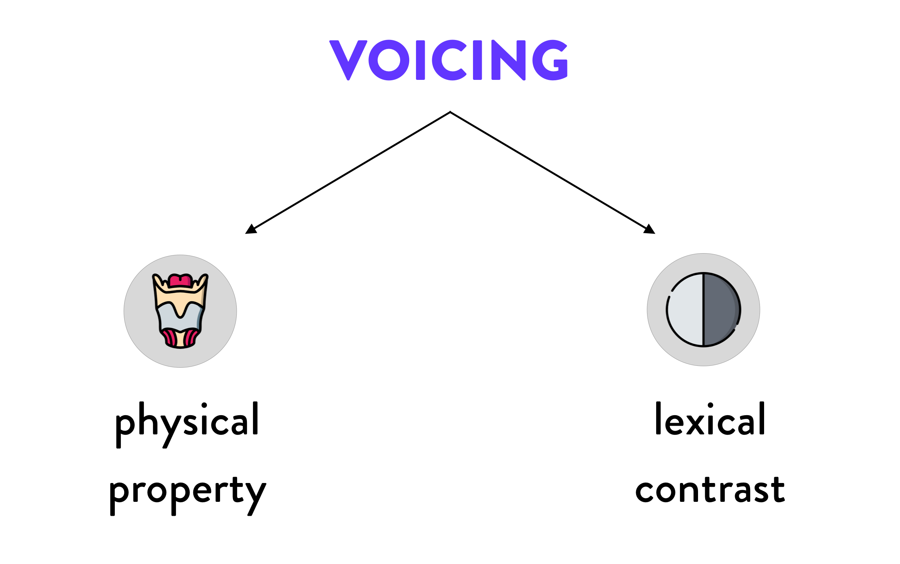

```{r setup}
library(tidyverse)
library(sf)
library(rnaturalearth)
library(leaflet)
library(sf)
library(lingtypology)
```


class: center middle

# ~ Voicing effect ~


---

```{r}
langs <- c("English", "German", "French", "Hungarian", "Gulf Arabic", "Assamese", "Bengali", "Dutch", "Georgian", "Hindi", "Italian", "Icelandic", "Japanese", "Korean", "Lithuanian", "Norwegian", "Spanish", "Swedish", "Telugu", "Russian", "Czech", "Polish")

longs <- long.lang(langs)
lats <- lat.lang(langs)

ve_langs <- tibble(longs, lats) %>%
  st_as_sf(coords = c("longs", "lats"))

leaflet(ve_langs) %>% 
  addTiles() %>%
  addCircleMarkers(stroke = FALSE, fillOpacity = 0.8)
```

---

# What is "voicing"?




---

# Voicing as a physical property


---

# Voicing as a linguistic contrast

